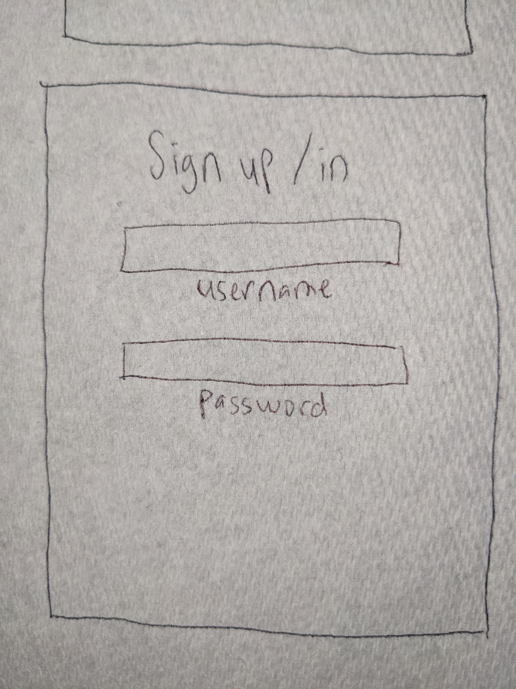
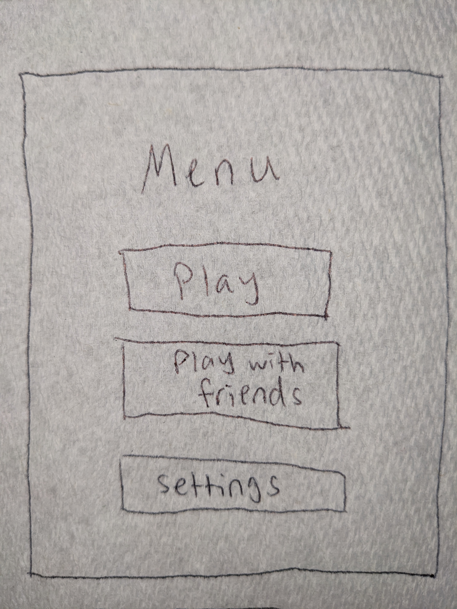
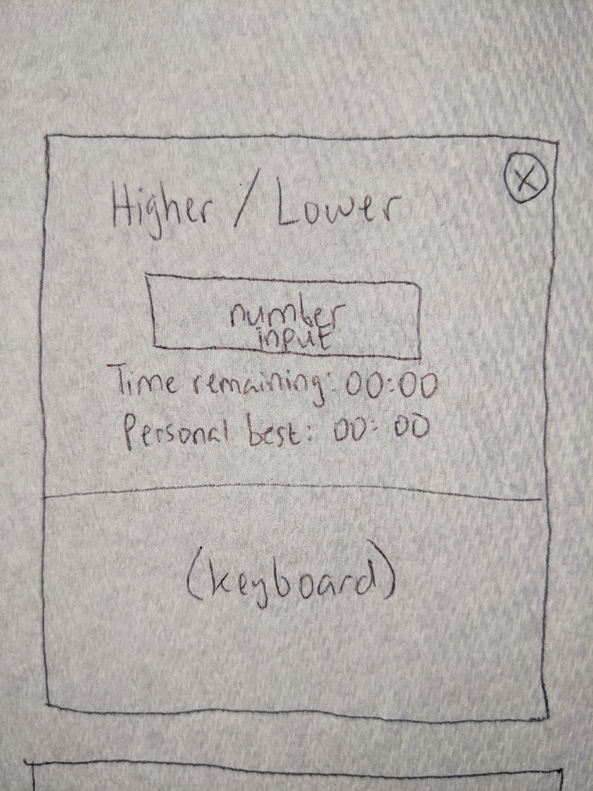
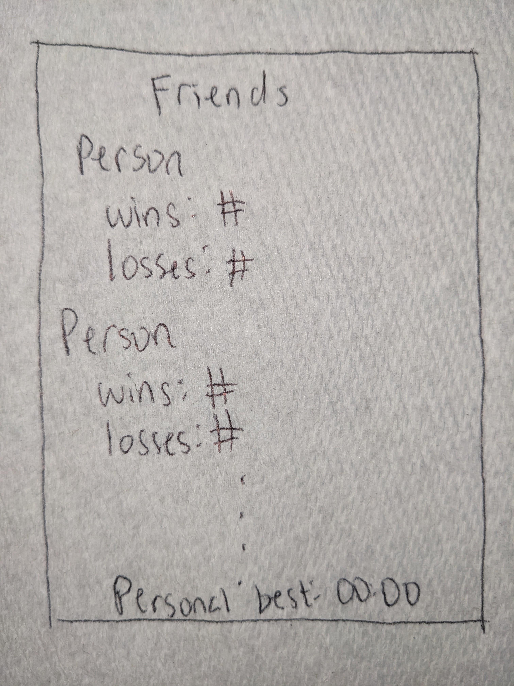

# Binary Mania

[My Notes](notes.md)

The ultimate binary number guessing game! Your only hope: a hint of higher or lower. Compete against time--and against friends--to guess the right number.

## 🚀 Specification Deliverable

For this deliverable I did the following. I checked the box `[x]` and added a description for things I completed.

- [x] Proper use of Markdown
- [x] A concise and compelling elevator pitch
- [x] Description of key features
- [x] Description of how you will use each technology
- [x] One or more rough sketches of your application. Images must be embedded in this file using Markdown image references.

### Elevator pitch

Do you dare to try your luck... in binary? The binary mania game is a number-guessing game where you can compete against friends in real time to guess the correct binary number! Be sure to know your counting, because the only hint is whether the number is higher or lower than your guess. Binary mania inspires fun competition, as the scoreboard tracks every win and loss you have against your components. Binary mania will have you thinking in binary in no time.

### Design

### Key features

- Secure log in over HTTPS
- Ability to input binary numbers
- Countdown timer in single-player mode
- Display higher/lower for guesses
- Game stops for both players when a player wins
- Scoring wins/losses against players

### Technologies

I am going to use the required technologies in the following ways.

- **HTML** - Uses 4 HTML pages: home, play, friends, and profile
- **CSS** - Applying styling that spaces the interactable buttons and text appropriately for different screen sizes
- **React** - Provides sign-in and buttons to input guesses
- **Service** - Backend service endpoints for:
    - sign-in
    - retrieving a number
    - submitting guesses
    - submitting scores
    - retrieving scores
- **DB/Login** - Stores users, friends, and scores in the database. Register and sign in users.
- **WebSocket** - When a player in multiplayer wins, the game is stopped for all players and the winner is announced.

## 🚀 AWS deliverable

For this deliverable I did the following. I checked the box `[x]` and added a description for things I completed.

- [x] **Server deployed and accessible with custom domain name** - [My server link](https://binarymania.click).

## 🚀 HTML deliverable

For this deliverable I did the following. I checked the box `[x]` and added a description for things I completed.

- [x] **HTML pages** - index, play, friends, and profile
- [x] **Proper HTML element usage** - headers, footers, tables, text, img, etc.
- [x] **Links** - nav links and github link
- [x] **Text** - headers, descriptions, footers, etc.
- [x] **3rd party API placeholder** - duck image
- [x] **Images** - duck image
- [x] **Login placeholder** - home page
- [x] **DB data placeholder** - friends tables, profile info, and login
- [x] **WebSocket placeholder** - play with friends, announce winner in play

## 🚀 CSS deliverable

For this deliverable I did the following. I checked the box `[x]` and added a description for things I completed.

- [x] **Visually appealing colors and layout. No overflowing elements.**
- [x] **Use of a CSS framework** - Every page uses Bootstrap.
- [x] **All visual elements styled using CSS**
- [x] **Responsive to window resizing using flexbox and/or grid display** - Every page uses flex.
- [x] **Use of a imported font** - Imported Orbitron.
- [x] **Use of different types of selectors including element, class, ID, and pseudo selectors**

## 🚀 React part 1: Routing deliverable

For this deliverable I did the following. I checked the box `[x]` and added a description for things I completed.

- [x] **Bundled using Vite**
- [x] **Components**
- [x] **Router**

## 🚀 React part 2: Reactivity deliverable

For this deliverable I did the following. I checked the box `[x]` and added a description for things I completed.

- [x] **All functionality implemented or mocked out** - Login is enforced. Localstorage is used to store userName. The play tab is now interactable. Friend requests and multiplayer functionality are mocked out (WebSocket functionality to fill in later).
- [x] **Hooks** - I used useState, useLocation, and useEffect for mocked functionality, multiplayer capability, friends, and number guessing in gameplay.

## 🚀 Service deliverable

For this deliverable I did the following. I checked the box `[x]` and added a description for things I completed.

- [x] **Node.js/Express HTTP service** - My service endpoints are found within index.js under the service directory.
- [x] **Static middleware for frontend** - I used middleware to ensure calls to endpoints that require sign in are not accessible without a valid authToken.
- [x] **Calls to third party endpoints** - In index.js on the server, the '/duck' endpoint calls a third party endpoint to grab a random picture of a duck. This picture is displayed on the profile page (profile.jsx).
- [x] **Backend service endpoints** - Backend service endpoints cover functionality for retrieving and altering users, friends, game requests, scores, online players, and friend requests.
- [x] **Frontend calls service endpoints** - In friends.jsx, calls are made to the friend-related server endpoints. In gameSession.jsx, calls are made to the scores endpoints. In profile.jsx, calls are made to the duck endpoint and the user endpoints.
- [x] **Supports registration, login, logout, and restricted endpoint** - Login/registration/logout functionality is demonstrated on the home page of the application (login.jsx and profile.jsx). The verfiyAuth middleware is used to ensure all sign-in-required calls are protected. These calls include friend data and scores data.

## 🚀 DB deliverable

For this deliverable I did the following. I checked the box `[x]` and added a description for things I completed.

- [x] **Stores data in MongoDB** - The name of the database is 'mania', and users are stored there with their properties. Code for the database can be found in database.js under the service directory.
- [x] **Stores credentials in MongoDB** - Credentials are included in the user data in the mania database.

## 🚀 WebSocket deliverable

For this deliverable I did the following. I checked the box `[x]` and added a description for things I completed.

- [x] **Backend listens for WebSocket connection** - I created a proxy server in the service directory.
- [x] **Frontend makes WebSocket connection** - The frontend uses a hook to assist in organizing messages.
- [x] **Data sent over WebSocket connection** - Data is sent as friend and game requests/accepts/declines as well as game over and exiting functionality.
- [x] **WebSocket data displayed** - Data is displayed through the functionality of navigation and friend/game requests.
- [x] **Application is fully functional** - All features are in place!
